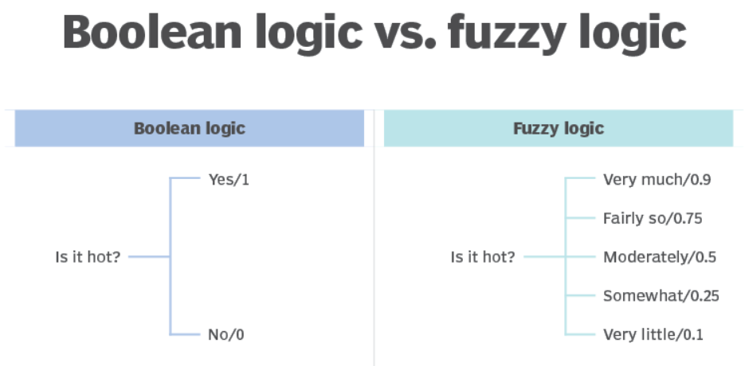
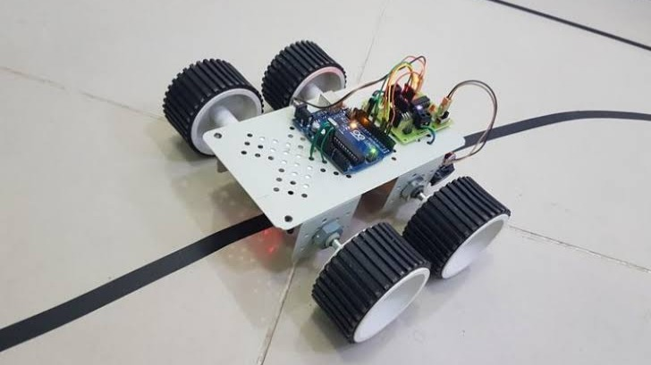

# A Fuzzy Logic and OpenCV-Based Line Follower Robot

A line follower robot using **Raspberry Pi 4, OpenCV, and Fuzzy Logic**
for real-time line detection and adaptive motor control.

---

## List of Content

- [Introduction](#Instroduction)
- [Literature](#Literature)
- [Design of Hardware and Software](#Design of Hardware and Software)

---

## Introduction

A line follower robot is an autonomous mobile robot designed to follow a predefined path or line. To maintain its position on the track, the robot needs to continuously detect the line and adjust the speed of its motors according to its position.

In this project, a line follower robot based on Fuzzy Logic and OpenCV is developed using a webcam and Raspberry Pi 4. The webcam captures the track, while OpenCV processes the image to detect the line and determine its position.

The detected line position is then used as an input to the Fuzzy Logic controller, which determines the appropriate speed for the left and right motors. This allows the robot to adjust its movement gradually when the line shifts to either side.

The main goal of this project is to explore the integration of computer vision and fuzzy logic control to achieve smoother and more adaptive line-following behavior.

---

## Literature

### Fuzzy Logic

  

Fuzzy Logic is a control method that allows a system to handle input values that are not strictly limited to binary conditions such as true or false. Instead, an input can have different degrees of membership within a fuzzy set. This makes fuzzy logic suitable for systems where the relationship between input conditions and control actions is not easily described by conventional mathematical models.

A fuzzy logic controller generally consists of three main processes: fuzzification, rule evaluation, and defuzzification. Fuzzification converts numerical input values into fuzzy variables. These variables are then evaluated using a set of IF–THEN rules to determine the appropriate control response. Finally, defuzzification converts the fuzzy output back into a numerical value that can be used by the system.

In this project, fuzzy logic is used to control the left and right motor speeds of the line follower robot. The information obtained from image processing is converted into fuzzy inputs, which are then processed using predefined rules to determine the appropriate motor speed. This allows the robot to adjust its movement according to the detected position of the line.

### Line Follower Robot

  

A line follower robot is an autonomous mobile robot designed to follow a predefined line or path on a surface. The robot continuously detects the position of the line and adjusts its movement to remain aligned with the track.

In this project, line detection is performed using a webcam and OpenCV. The captured image is processed to identify the line based on the distribution of black pixels in selected regions of the image.

The detected line position is then used as an input for the Fuzzy Logic controller. The controller determines the appropriate speed of the left and right motors, allowing the robot to adjust its direction and follow the line more smoothly.

### OpenCV

  

OpenCV (Open Source Computer Vision Library) is an open-source library designed for image and video processing and computer vision applications. It provides various tools for capturing, processing, and analyzing visual information in real time.

In this project, OpenCV is used to capture images from the webcam and process the captured frames to detect the line. The image is divided into specific regions of interest, and the distribution of black pixels is analyzed to determine the position of the line.

The detected line information is then passed to the Fuzzy Logic controller to determine the appropriate speed of the left and right motors.

### Raspberry Pi 4

  

Raspberry Pi 4 is a single-board computer that can run an operating system and execute programs for various applications, including robotics and computer vision. It provides sufficient computational capability to process camera data and run Python-based applications.

In this project, the Raspberry Pi 4 acts as the main processing and control unit. It receives images from the webcam, processes them using OpenCV, and determines the position of the line. The resulting information is then processed by the Fuzzy Logic controller to determine the appropriate motor speeds.

### L293D

  

---

## Design of Hardware and Software

  

### Hardware

| Component | Quantity | Function |
|:---|:---:|:---|
| 🤖 **Line Follower Robot Kit** | 1 | Main mechanical platform |
| 🧠 **Raspberry Pi 4** | 1 | Main processing and control unit |
| ⚙️ **L293D** | 1 | Controls DC motors |
| 🖥️ **Monitor Display** | 1 | Raspberry Pi display |
| 🔋 **Powerbank** | 1 | Power source |
| 🔗 **Jumper Wires** | As needed | Electrical connections |
| 📷 **Webcam** | 1 | Captures the line and track |

### Software & Libraries

| Software / Library | Purpose |
|:---|:---|
| 🐍 **Python** | Main programming language |
| 👁️ **OpenCV** | Image processing and line detection |
| 🧠 **scikit-fuzzy** | Fuzzy logic controller |
| 🐧 **Raspbian OS** | Operating system for Raspberry Pi |
